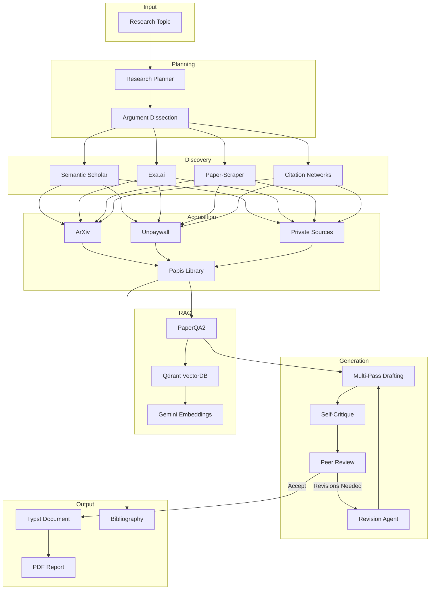

<p align="center">
  <h1 align="center">Research Agent CLI</h1>
  <p align="center">
    <strong>Autonomous Research Assistant and Paper Writer</strong>
  </p>
  <p align="center">
    An agentic system that conducts academic research, synthesizes findings, and generates compiled documents with verified citations.
  </p>
</p>

<p align="center">
  <a href="#installation">Installation</a> •
  <a href="#quick-start">Quick Start</a> •
  <a href="#features">Features</a> •
  <a href="#architecture">Architecture</a> •
  <a href="#documentation">Docs</a>
</p>

<p align="center">
  
  
  
  
</p>

---

## Overview

Research Agent CLI is a command-line tool that autonomously conducts academic research. Given a topic, it:

1. **Plans** research by decomposing topics into research questions
2. **Discovers** relevant papers via Semantic Scholar, Exa.ai, and citation networks
3. **Acquires** PDFs through ArXiv, Unpaywall, and configurable private sources
4. **Synthesizes** information using RAG (PaperQA2 + Qdrant vector database)
5. **Writes** structured documents with Typst, including proper citations
6. **Reviews** output through an automated peer review system
7. **Revises** based on feedback until quality thresholds are met

The agent produces compiled PDFs with full bibliographies, saved to versioned report directories.

---

## Features

| Feature | Description |
|---------|-------------|
| **Autonomous Research** | Multi-phase workflow from topic to finished document |
| **Multi-Source Discovery** | Semantic Scholar, Exa.ai, paper-scraper, citation networks |
| **RAG-Powered QA** | Ask questions about your paper library with citations |
| **Citation Management** | Automatic BibTeX handling via Papis |
| **Peer Review Loop** | Automated quality assurance with iterative revision |
| **Typst Output** | Modern typesetting with custom academic templates |
| **Persistent Index** | Qdrant vector database for fast repeated queries |
| **Library Tools** | Add papers by DOI/arXiv, fuzzy citation search, open papers |

---

## Quick Start

```bash
# Clone and setup
git clone https://github.com/gbrlpzz/research-agent-cli.git
cd research-agent-cli
python3 -m venv .venv && source .venv/bin/activate
pip install -r requirements.txt

# Configure API keys
cp .env.example .env
# Edit .env with your GEMINI_API_KEY (required)

# Run your first research task
research agent "Impact of attention mechanisms on neural machine translation"
```

Output is saved to `reports/<timestamp>_<topic>/` containing:
- `main.typ` - Typst source
- `main.pdf` - Compiled document
- `refs.bib` - Bibliography
- `artifacts/` - Drafts, reviews, plans

---

## Installation

### Prerequisites

- **Python 3.10+**
- **Typst** - For PDF compilation ([typst.app](https://typst.app))
- **Papis** - Bibliography manager (installed via pip)

### Step 1: Clone Repository

```bash
git clone https://github.com/gbrlpzz/research-agent-cli.git
cd research-agent-cli
```

### Step 2: Create Virtual Environment

```bash
python3 -m venv .venv
source .venv/bin/activate  # On Windows: .venv\Scripts\activate
```

### Step 3: Install Dependencies

```bash
pip install -r requirements.txt

# Paper-scraper (optional, for extended search):
pip install git+https://github.com/blackadad/paper-scraper.git
```

### Step 4: Install Typst

```bash
# macOS
brew install typst

# Linux
curl -fsSL https://typst.app/install.sh | sh

# Or download from: https://github.com/typst/typst/releases
```

### Step 5: Configure Environment

Create a `.env` file in the project root:

```env
# Required
GEMINI_API_KEY=your_gemini_api_key

# Optional - Enhanced discovery
EXA_API_KEY=your_exa_key
SEMANTIC_SCHOLAR_API_KEY=your_s2_key

# Optional - Tuning
AGENT_MAX_ITERATIONS=50
REVISION_MAX_ITERATIONS=25
MAX_REVIEWER_ITERATIONS=15
API_TIMEOUT_SECONDS=120
```

### Step 6: Add to PATH (Optional)

```bash
# Add to ~/.zshrc or ~/.bashrc
export PATH="$PATH:/path/to/research-agent-cli/bin"
```

---

## Usage

### CLI Reference

| Command | Description |
|---------|-------------|
| `research <query>` | Search for papers (Semantic Scholar + paper-scraper) |
| `research agent <topic>` | Run autonomous research agent |
| `research qa <question>` | Ask questions about your library (RAG) |
| `research add <id>` | Add paper by DOI or arXiv ID |
| `research cite [query]` | Fuzzy search and copy citation keys |
| `research open [query]` | Open paper from library in browser |
| `research exa <query>` | Semantic search via Exa.ai (costs credits) |
| `research edison <query>` | AI literature synthesis (costs credits) |
| `research help` | Interactive tutorial |

### Examples

#### Run the Research Agent

```bash
# Basic usage
research agent "Transformer architectures in computer vision"

# With custom revision rounds
research agent -r 5 "Few-shot learning in large language models"

# Multiple parallel reviewers
research agent --reviewers 2 "Attention mechanisms in NLP"
```

#### Query Your Library

```bash
# Ask a research question
research qa "How does self-attention differ from recurrent mechanisms?"

# Interactive chat mode
research qa -i
```

#### Manage Papers

```bash
# Add by DOI
research add 10.48550/arXiv.1706.03762

# Add by arXiv ID
research add 1706.03762

# Search and add interactively
research "vision transformers"  # Select papers with fzf
```

#### Citation Management

```bash
# Find citation key for a paper
research cite vaswani

# Copy key to clipboard (macOS)
research cite transformer | pbcopy
```

---

## Architecture



### Component Overview

| Component | Technology | Purpose |
|-----------|------------|---------|
| **LLM** | Gemini 2.0 Flash | Planning, writing, reviewing |
| **RAG Framework** | PaperQA2 | Question-answering over papers |
| **Vector Database** | Qdrant | Persistent document embeddings |
| **Embeddings** | text-embedding-004 | Document vectorization |
| **Bibliography** | Papis | Local PDF library management |
| **Typesetting** | Typst | compiled PDF generation |

---

## Configuration

### Environment Variables

| Variable | Required | Default | Description |
|----------|----------|---------|-------------|
| `GEMINI_API_KEY` | Yes | - | Google AI API key |
| `EXA_API_KEY` | No | - | Exa.ai API key for neural search |
| `SEMANTIC_SCHOLAR_API_KEY` | No | - | S2 API key (higher rate limits) |
| `AGENT_MAX_ITERATIONS` | No | 50 | Max agent loop iterations |
| `REVISION_MAX_ITERATIONS` | No | 25 | Max revision iterations |
| `MAX_REVIEWER_ITERATIONS` | No | 15 | Max reviewer tool calls |
| `API_TIMEOUT_SECONDS` | No | 120 | API call timeout |

### Directory Structure

```
research-agent-cli/
├── bin/research          # CLI entry point
├── scripts/
│   ├── agent.py          # Autonomous research agent
│   ├── qa.py             # RAG question-answering
│   ├── discover.py       # Paper search
│   ├── add.py            # Paper acquisition
│   ├── cite.py           # Citation lookup
│   ├── tools/            # Shared tool implementations
│   └── utils/            # Helper utilities
├── library/              # Local PDF collection (Papis)
├── reports/              # Generated research outputs
├── templates/            # Typst templates
├── docs/                 # Documentation
└── master.bib            # Master bibliography
```

---

## Tech Stack

| Technology | Version | Purpose | Link |
|------------|---------|---------|------|
| **PaperQA2** | 5.0+ | RAG for academic papers | [paper-qa](https://github.com/Future-House/paper-qa) |
| **Qdrant** | Latest | Vector database | [qdrant](https://qdrant.tech/) |
| **Google Gemini** | 2.0 Flash | LLM for reasoning | [Google AI](https://ai.google.dev/) |
| **Semantic Scholar** | API v1 | Paper discovery | [semanticscholar.org](https://www.semanticscholar.org/) |
| **Exa.ai** | Latest | Neural search | [exa.ai](https://exa.ai/) |
| **Papis** | Latest | Bibliography management | [papis](https://github.com/papis/papis) |
| **Typst** | 0.11+ | Document typesetting | [typst.app](https://typst.app/) |
| **Rich** | Latest | Terminal UI | [rich](https://github.com/Textualize/rich) |

---

## Documentation

- [Methodology](docs/METHODOLOGY.md) - Research workflow and agent phases
- [Technical Reference](docs/TECHNICAL.md) - Architecture and implementation details
- [Limitations](docs/LIMITATIONS.md) - Known constraints and roadmap

---

## Contributing

Contributions are welcome. Please open an issue to discuss proposed changes before submitting a pull request.

1. Fork the repository
2. Create a feature branch (`git checkout -b feature/improvement`)
3. Commit changes (`git commit -am 'Add improvement'`)
4. Push to branch (`git push origin feature/improvement`)
5. Open a Pull Request

---

## License

This project is licensed under the Apache License 2.0. See [LICENSE](LICENSE) for details.

---

## Acknowledgments

Built with [PaperQA2](https://github.com/Future-House/paper-qa) by Future House, [Qdrant](https://qdrant.tech/), and [Google Gemini](https://ai.google.dev/).
