# Research Agent CLI

A multi-phase pipeline for automated academic research. The system discovers papers, constructs a vector-indexed library, generates structured documents with inline citations, and iterates through peer review until acceptance criteria are met.

Supports configurable private PDF sources for institutions with licensed access.

## Architecture

```mermaid
flowchart TB
    subgraph INPUT
        Topic[Research Topic]
    end

    subgraph PLANNING["Phase 1: Planning"]
        Plan[LLM Decomposition]
        Plan --> Questions[Research Questions]
        Plan --> Concepts[Key Concepts]
        Plan --> ArgMap[Argument Map]
        Plan --> Queries[Search Queries]
    end

    subgraph DISCOVERY["Phase 2: Discovery"]
        direction TB
        SS[Semantic Scholar API]
        Exa[Exa.ai Neural Search]
        Cite[Citation Networks]
        Queries --> SS
        Queries --> Exa
        Queries --> Cite
        SS --> Papers[Paper Candidates]
        Exa --> Papers
        Cite --> Papers
    end

    subgraph ACQUISITION["Phase 3: Acquisition"]
        direction TB
        ArXiv[ArXiv]
        Unpay[Unpaywall]
        Private[Private Sources]
        Papers --> ArXiv
        Papers --> Unpay
        Papers --> Private
        ArXiv --> PDFs[PDF Collection]
        Unpay --> PDFs
        Private --> PDFs
    end

    subgraph INDEXING["Phase 4: Indexing"]
        PaperQA[PaperQA2 Chunking]
        Qdrant[(Qdrant Vector DB)]
        PDFs --> PaperQA
        PaperQA --> Qdrant
    end

    subgraph DRAFTING["Phase 5: Drafting Loop"]
        Agent[Tool-Calling Agent]
        Qdrant -.-> Agent
        
        subgraph Tools
            T1[query_library]
            T2[discover_papers]
            T3[fuzzy_cite]
            T4[validate_citations]
        end
        
        Agent --> T1
        Agent --> T2
        Agent --> T3
        Agent --> T4
        Agent --> Draft[Typst Draft]
    end

    subgraph REVIEW["Phase 6: Review Loop"]
        Reviewer[Peer Reviewer Agent]
        Draft --> Reviewer
        
        subgraph Checks
            C1[Citation Validity]
            C2[Claim Grounding]
            C3[Coverage Analysis]
            C4[Counter-Arguments]
        end
        
        Reviewer --> C1
        Reviewer --> C2
        Reviewer --> C3
        Reviewer --> C4
        C1 --> Verdict{Verdict}
        C2 --> Verdict
        C3 --> Verdict
        C4 --> Verdict
        Verdict -->|ACCEPTED| Final[Finalize]
        Verdict -->|REVISIONS| Revise
    end

    subgraph REVISION["Phase 7: Revision"]
        Revise[Revision Agent]
        Revise --> |Feedback Loop| Agent
    end

    subgraph FINALIZATION
        Final --> BibFilter[Filter Bibliography]
        Final --> StarHash[Generate Star Hash]
        Final --> Compile[Typst Compile]
    end

    subgraph OUTPUT
        Compile --> PDF[main.pdf]
        BibFilter --> Bib[refs.bib]
        Compile --> Artifacts[artifacts/]
    end

    Topic --> Plan

    style INPUT fill:#222,stroke:#333,stroke-width:2px
    style PLANNING fill:#1a1a2e,stroke:#4a4e69
    style DISCOVERY fill:#16213e,stroke:#4a4e69
    style ACQUISITION fill:#1a1a2e,stroke:#4a4e69
    style INDEXING fill:#16213e,stroke:#4a4e69
    style DRAFTING fill:#1a1a2e,stroke:#4a4e69
    style REVIEW fill:#16213e,stroke:#4a4e69
    style REVISION fill:#1a1a2e,stroke:#4a4e69
    style FINALIZATION fill:#16213e,stroke:#4a4e69
    style OUTPUT fill:#222,stroke:#333,stroke-width:2px
```


```

## Installation

```bash
git clone https://github.com/gbrlpzz/research-agent-cli.git
cd research-agent-cli
python3 -m venv .venv && source .venv/bin/activate
pip install -r requirements.txt
cp .env.example .env  # Configure API keys
```

Typst is required for PDF compilation:
```bash
brew install typst  # macOS
# Or download from https://github.com/typst/typst/releases
```

## Usage

```bash
research agent "Attention mechanisms in transformer architectures"
```

Output directory structure:
```
reports/<timestamp>_<topic>/
├── main.typ              # Typst source
├── main.pdf              # Compiled document
├── refs.bib              # Bibliography (cited papers only)
├── literature_sheet.csv  # Paper metadata
└── artifacts/            # Intermediate outputs (plans, drafts, reviews)
```

### Command Reference

| Command | Function |
|---------|----------|
| `research agent <topic>` | Execute full pipeline |
| `research agent -i <topic>` | Interactive mode (model selection, iteration limits) |
| `research agent --resume <path>` | Resume from checkpoint |
| `research qa <question>` | Query library via RAG |
| `research <query>` | Search Semantic Scholar |
| `research add <id>` | Add paper by DOI or arXiv ID |
| `research cite [query]` | Fuzzy-match citation keys |
| `research exa <query>` | Neural search via Exa.ai |

### Agent Options

```
Options:
  -i, --interactive           Configuration menu before execution
  --resume PATH               Resume from existing report directory
  -r, --revisions N           Maximum peer review rounds (default: 3)
  --reviewers N               Parallel reviewer count (default: 1)
  --budget {low,balanced,high}  Cost/quality tradeoff (default: low)
  --reasoning-model MODEL     LLM for planning, drafting, review
  --rag-model MODEL           LLM for PaperQA queries
  --embedding-model MODEL     Embedding model for indexing
```

### Budget Modes

| Mode | Model Selection | Citation Target | Strategy |
|------|-----------------|-----------------|----------|
| `low` | gemini-2.5-flash | 10+ | Query existing library first; discover only for gaps |
| `balanced` | Mixed (flash/pro) | 12+ | Query first; discover when gaps identified |
| `high` | gemini-3-pro | 15+ | Proactive discovery; traverse citation networks |

## Configuration

Environment variables (`.env`):

```env
# Required: at least one LLM API key
GEMINI_API_KEY=<key>
OPENAI_API_KEY=<key>

# Model routing (optional)
RESEARCH_REASONING_MODEL=gemini/gemini-2.5-flash
RESEARCH_RAG_MODEL=gemini/gemini-2.5-flash
RESEARCH_EMBEDDING_MODEL=openai/text-embedding-3-large

# Discovery APIs (optional)
SEMANTIC_SCHOLAR_API_KEY=<key>
EXA_API_KEY=<key>

# Tuning parameters (optional)
AGENT_MAX_ITERATIONS=50
REVISION_MAX_ITERATIONS=25
MAX_REVIEWER_ITERATIONS=15
API_TIMEOUT_SECONDS=120
```

## Project Structure

```
research-agent-cli/
├── bin/research                # CLI entry point
├── scripts/
│   ├── agent.py                # Pipeline orchestration
│   ├── phases/
│   │   ├── orchestrator.py     # Model selection, cost tracking
│   │   ├── planner.py          # Research decomposition
│   │   ├── drafter.py          # Document generation
│   │   ├── reviewer.py         # Peer review
│   │   ├── reviser.py          # Revision handling
│   │   └── tool_registry.py    # Tool definitions
│   ├── tools/                  # Tool implementations
│   ├── qa.py                   # RAG interface
│   └── utils/                  # LLM wrapper, prompts, Typst utilities
├── library/                    # PDF storage
├── reports/                    # Generated outputs
├── templates/typst-template/   # Document template (submodule)
└── master.bib                  # Master bibliography
```

## Dependencies

| Component | Function |
|-----------|----------|
| [PaperQA2](https://github.com/Future-House/paper-qa) | RAG over academic papers |
| [Qdrant](https://qdrant.tech/) | Vector storage |
| [LiteLLM](https://github.com/BerriAI/litellm) | Multi-provider LLM routing |
| [Papis](https://github.com/papis/papis) | Bibliography management |
| [Typst](https://typst.app/) | Document compilation |
| [Semantic Scholar API](https://www.semanticscholar.org/product/api) | Paper discovery |

## Limitations

- Requires LLM API access (Gemini or OpenAI)
- PDF availability varies by source
- Generated citations require manual verification
- Semantic Scholar and Exa.ai impose rate limits
- Optimized for English-language literature

## License

Apache License 2.0
