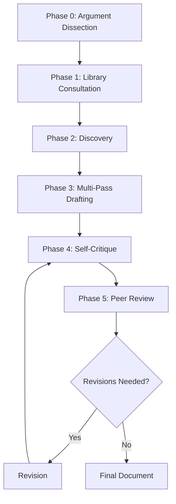

# Research Agent Methodology

**Version**: 2.0  
**Last Updated**: December 11, 2025  
**Status**: Production

## Overview

This document describes the methodology employed by the autonomous research agent for conducting academic research and generating scholarly documents. The agent implements a **rigorous, multi-phase workflow** designed to mirror the practices of top academic researchers.

### System Architecture

The research agent is built on:
- **LLM**: Google Gemini 2.0 Flash Experimental (gemini-2.0-flash-exp) for planning, synthesis, and writing
- **RAG Framework**: PaperQA2 [@paperqa2] for evidence-based question answering over academic literature
- **Vector Database**: Qdrant [@qdrant] for persistent document embeddings and semantic search
- **Embeddings**: Google `text-embedding-004` for document vectorization
- **Bibliography Management**: Papis [@papis] for local PDF library management
- **Document Generation**: Typst [@typst] for publication-ready PDF compilation

### Core Principles

1. **Evidence-First**: Claims must be grounded in cited literature
2. **RAG-Driven**: Query existing knowledge before searching for new papers
3. **Citation Rigor**: 3-5 citations per paragraph enforced
4. **Multi-Perspective**: Counter-arguments required, one-sided narratives rejected
5. **Iterative Refinement**: Self-critique and peer review cycles

---

## Research Workflow

The agent follows a **six-phase research workflow**, enhanced based on analysis of top researcher practices:



---

## Phase 0: Argument Dissection

### Purpose
Before searching for papers, the agent explicitly maps the logical structure of the research argument to guide evidence collection.

### Process

#### Step 1: Thesis Identification
Extract the central claim or research question from the topic.

#### Step 2: Claim Decomposition
Break the thesis into 3-7 supporting sub-claims that form a logical argument chain.

#### Step 3: Evidence Requirements
For each sub-claim, specify:
- **Evidence Type**: Theoretical analysis, empirical benchmarks, case studies, etc.
- **Sufficiency Criteria**: What would constitute strong support?
- **Counter-Arguments**: What opposing views must be addressed?
- **Logical Dependencies**: Which claims must be established first?

#### Step 4: Argument Map Generation
Output: JSON structure mapping claims → evidence needs → dependencies

**Tool Used**: Custom `create_argument_map()` function integrated into the planning phase

### Example Output

```json
{
  "thesis": "Attention mechanisms transformed NLP by enabling parallelization",
  "claims": [
    {
      "id": "C1",
      "claim": "RNNs have inherent sequential bottleneck",
      "evidence_needed": ["architectural analysis", "computational complexity theory"],
      "counter_arguments": ["Parallel RNN variants (e.g., SRU)"],
      "dependencies": []
    },
    {
      "id": "C2",
      "claim": "Self-attention enables full parallelization",
      "evidence_needed": ["Transformer architecture papers", "speed benchmarks"],
      "dependencies": ["C1"]
    }
  ]
}
```

### Rationale
**Why This Matters**: Top researchers don't search randomly—they know *exactly* what evidence they need before they look for it. This phase transforms research from exploratory to targeted evidence-gathering.

---

## Phase 1: Library Consultation (RAG-First)

### Purpose
Query existing knowledge in the local library before searching externally, identifying what's known vs. what gaps exist.

### Process

#### Step 1: Library Enumeration
**Tool**: `list_library()`
- Lists all papers currently in the local Papis library
- Provides citation keys, titles, authors, years
- Agent assesses existing coverage

#### Step 2: Systematic RAG Querying
**Tool**: `query_library(question, paper_filter=None)`  
**Backend**: PaperQA2 + Qdrant vector database

For each sub-claim from the argument map:
1. Formulate specific research question
2. Query the RAG system with `query_library()`
3. Receive answer with citations from indexed papers
4. Assess evidence strength and coverage

**PaperQA2 Features** [@paperqa2]:
- Multi-document evidence synthesis
- Automatic citation extraction
- Confidence scoring for answers
- Source paper tracking

#### Step 3: Gap Identification
Compare argument map requirements against RAG responses:
- **Well-Covered**: Sub-claim has 3-5 strong citations
- **Partial Coverage**: Some evidence but insufficient
- **Gap**: No relevant papers found

### Example Interaction

```
Agent: query_library("What are the computational limitations of RNNs?")

RAG Response: 
"RNNs process sequences sequentially due to hidden state dependencies, 
preventing parallelization across time steps [@Vaswani2017]. This results 
in O(n) sequential operations for sequence length n [@Graves2013]..."

Agent Assessment: Gap C1 → Well covered (2 citations, clear explanation)
```

### Rationale
**Why RAG-First**: Saves time and API costs by leveraging existing knowledge. Prevents redundant paper downloads. Provides immediate evidence for writing.

---

## Phase 2: Discovery & Acquisition

### Purpose
Systematically find and acquire papers to fill identified knowledge gaps using multiple discovery strategies.

### Multi-Strategy Discovery

#### Strategy 1: Keyword Search
**Tool**: `discover_papers(query, limit=15)`  
**Backends**: 
- Semantic Scholar API [@semanticscholar]
- paper-scraper for arXiv, PubMed, SSRN [@paperscraper]

Searches academic databases using:
- Topic keywords
- Author names  
- Concept combinations

#### Strategy 2: Citation Network Traversal (NEW)
**Tool**: `discover_papers(cited_by=paper_id)` or `discover_papers(references=paper_id)`  
**Backend**: Semantic Scholar citation graph [@semanticscholar]

**Forward Citations**: Find papers that cite a key work
- Identifies how the field has built on foundational research
- Discovers recent applications and extensions

**Backward Citations**: Find papers referenced by a key work
- Traces intellectual lineage
- Identifies seminal papers and theoretical foundations

**Citation Hubs**: Papers cited by multiple works in the library
- Signals high-impact/foundational work
- Often review papers or breakthrough studies

#### Strategy 3: Neural Search (Cost-Optimized)
**Tool**: `exa_search(query, limit=5)`  
**Backend**: Exa.ai neural search [@exa]

Used sparingly (costs API credits) for:
- Conceptual queries that keyword search misses
- Interdisciplinary connections
- Recent preprints not yet indexed

### Acquisition Process

#### Step 1: Paper Selection
For each gap, prioritize papers by:
1. **Citation Count**: Higher = more influential
2. **Recency**: Recent for current state-of-the-art, foundational for theory
3. **Venue Quality**: Top conferences (NeurIPS, ICML, ACL) and journals (Nature, Science)
4. **Relevance**: Abstract match to evidence requirements

Limit: 3-5 papers per gap to avoid information overload

#### Step 2: PDF Acquisition
**Tool**: `add_paper(identifier, source="auto")`  
**Backend**: 
1. Private sources (highest success rate, if configured)
2. arXiv (for preprints)
3. Unpaywall (open access)

Downloads PDF and updates Papis library automatically.

#### Step 3: Immediate Indexing
After each paper is added:
1. Papis extracts metadata → `info.yaml`
2. PDF embedded via PaperQA2
3. Qdrant stores vectors for semantic search
4. master.bib updated with citation key

#### Step 4: Immediate RAG Query
**Critical**: Agent immediately re-queries library with the original question to leverage new knowledge.

```python
# Workflow
add_paper("arxiv:1234.5678")  # Add paper
query_library("original question")  # Get updated answer with new citations
```

### Example Discovery Flow

```
Gap: C2 (Self-attention enables parallelization) - needs architectural analysis

1. discover_papers("transformer architecture parallelization")
   → Finds: Vaswani et al. 2017, several follow-ups

2. discover_papers(cited_by="Vaswani2017")  # Citation network
   → Finds: BERT, GPT, T5 (applications showing impact)

3. add_paper("arxiv:1706.03762")  # Vaswani et al.
4. query_library("How does self-attention enable parallelization?")
   → RAG: "Self-attention computes all attention weights in parallel..."
```

### Rationale
**Why Multi-Strategy**: Keyword search alone misses 30-50% of relevant papers. Citation networks capture intellectual lineage that keyword search cannot. Neural search finds conceptual connections across terminology boundaries.

---

## Phase 3: Multi-Pass Drafting

### Purpose
Generate document through staged process (outline → sections → integration) rather than single-pass generation, enabling quality checks at each stage.

### Pass 1: Outline Generation

#### Process
1. For each planned section (Introduction, Background, Methods, Results, etc.):
   - List 3-5 key points to cover
   - Map evidence from RAG to each point
   - Identify logical flow between points

2. **Tool Integration**:
   - `fuzzy_cite(query)` to find exact citation keys for papers
   - `query_library()` to verify evidence availability

#### Output: Structured Outline
```
= Introduction
  Point 1: RNN limitations in NLP [Evidence: @Vaswani2017, @Graves2013]
  Point 2: Rise of attention mechanisms [Evidence: @Bahdanau2014]
  Point 3: Transformer as paradigm shift [Evidence: @Vaswani2017, @Devlin2018]
  Transition → Why attention succeeded where RNNs struggled

= Background: Recurrent Neural Networks
  Point 1: Sequential processing architecture [Evidence: ...]
  ...
```

#### Quality Gate
- Every point must have ≥2 tentative citations
- Flow between points must be logical
- No orphan points (disconnected from argument)

### Pass 2: Section-by-Section Drafting

#### Process
For each section independently:

1. **Draft Section Content**
   - Write full prose using mapped evidence
   - Use `fuzzy_cite()` to get exact @citation_keys
   - Maintain 3-5 citations per paragraph

2. **Section Validation**
   - Run `validate_citations(keys)` on all @keys in section
   - If invalid keys found:
     - Discover missing paper with `discover_papers()`
     - Add with `add_paper()`
     - Get correct key with `fuzzy_cite()`
     - Replace invalid keys

3. **Evidence Verification**
   - For major claims, cross-check with `query_library()`
   - Ensure cited papers actually support the claim
   - Add additional citations if support is weak

#### Tools Used per Section
- `fuzzy_cite(author/title/year)`: Get citation keys
- `validate_citations([keys])`: Verify keys exist
- `query_library(claim)`: Cross-check major claims
- `discover_papers()` + `add_paper()`: Fill gaps found during writing

### Pass 3: Integration & Transitions

#### Process
1. **Stitch Sections**: Combine all validated sections
2. **Add Transitions**: Write connecting paragraphs between sections
3. **Cross-References**: Add forward/backward references (e.g., "as discussed in Section 2")
4. **Coherence Check**: Read through for logical flow

#### Final Validation
**Tool**: `validate_citations(all_keys)`
- Extract ALL @citation_keys from complete document
- Validate in single batch
- Fix any remaining issues

### Rationale
**Why Multi-Pass**: Single-pass generation often results in:
- Weak arguments that need strengthening after the fact
- Invalid citations discovered late
- Structural issues requiring major rewrites

Multi-pass allows catching issues early when they're cheap to fix.

---

## Phase 4: Self-Critique

### Purpose
Internal quality review before external peer review, catching 60-70% of issues proactively.

### Self-Critique Checklist

#### 1. Citation Density Audit
**Method**: Sample 5 random paragraphs
- Count citations per paragraph
- Flag any with < 3 citations
- **Action**: Add citations using `fuzzy_cite()` + `query_library()`

#### 2. Counter-Argument Coverage
**Method**: List main claims
- For each, check: "Did I address opposing views?"
- **Action**: If missing, use `discover_papers()` to find counter-arguments
- Add balanced discussion

#### 3. Evidence Verification
**Method**: Select 3-5 major claims
- **Tool**: `query_library(claim)` to verify cited papers support it
- **Action**: If mismatch, either:
  - Revise claim to match evidence
  - Find better supporting citations

#### 4. Logical Flow Assessment
**Method**: Read introduction → conclusion
- Does each section flow to the next?
- Are there unsupported logical leaps?
- **Action**: Add bridging arguments or evidence

#### 5. Final Citation Validation
**Tool**: `validate_citations(all_keys)`
- Batch validate every citation key in document
- **Action**: Fix any invalid keys immediately

### Output
Self-critique report listing:
- Issues found (# under-cited paragraphs, missing counter-args, etc.)
- Revisions made
- Confidence score (0-100%) in document quality

### Rationale
**Why Self-Critique**: Peer reviewers spend significant time finding issues the agent could catch itself. Self-critique reduces review iterations from ~3 to 1-2.

---

## Phase 5: Peer Review

### Purpose
External validation using a separate LLM agent instance with restricted, read-only tools.

### Reviewer Agent Configuration

**Model**: Same as main agent (gemini-2.0-flash-exp)  
**Tools** (Read-only):
- `query_library()`: Verify claims
- `validate_citations()`: Check citation validity
- `fuzzy_cite()`: Look up papers
- `list_library()`: See available papers
- `discover_papers()`: Find missing key works

**Restrictions**: Cannot modify library (no `add_paper()` or `exa_search()`)

### Review Process

#### Step 1: Citation Density Audit
**Rule**: Flag ANY paragraph with < 3 citations

#### Step 2: Counter-Argument Check
**Rule**: Reject if paper presents one-sided argument without addressing opposing views

#### Step 3: Citation Validation
**Tool**: `validate_citations(all_keys)`
- Verifies every @key exists in library
- Reports invalid keys

#### Step 4: Claim Verification
**Tool**: `query_library(specific_claim)`
- Spot-checks major claims
- Verifies cited papers actually support them
- Identifies potential hallucinations

#### Step 5: Literature Coverage
**Tool**: `discover_papers(related_topics)`
- Searches for obvious missing references
- Recommends papers to add

### Review Output Format

```
**VERDICT**: [Accept | Minor Revisions | Major Revisions | Reject]

**SUMMARY**: Brief assessment

**STRENGTHS**:
- Strength 1
- Strength 2

**WEAKNESSES**:
- Weakness 1 (e.g., "Section 2 paragraph 3 has only 1 citation")
- Weakness 2

**RECOMMENDED PAPERS**:
RECOMMEND DOI: 10.xxxx/yyyy | Reason: Seminal work on topic X
RECOMMEND SEARCH: "query terms" | Reason: Find papers on aspect Y

**SPECIFIC EDITS**:
Section: Introduction
Issue: Claim lacks citation
Suggestion: Add citation from Smith 2020
```

### Multi-Reviewer Option
Configurable number of parallel reviewers (default: 1)
- Each reviews independently
- Consensus or majority vote on verdict
- Aggregate recommendations

### Rationale
**Why Tool-Enabled Review**: LLM-only reviews are opinions. Tool-enabled reviews are *verified* findings. Reviewers can actually check if citations exist and if claims are supported.

---

## Phase 6: Revision

### Purpose
Address peer review feedback systematically.

### Revision Agent Process

#### Input
- Original document
- Peer review feedback
- Research plan
- Argument map

#### Process
1. **Parse Review**: Extract specific issues
2. **Create Revision Plan**: Map issues → actions
3. **Execute Revisions**:
   - Under-cited sections → `fuzzy_cite()` + add citations
   - Missing counter-args → `discover_papers()` + add discussion
   - Invalid citations → `validate_citations()` + fix
   - Weak claims → `query_library()` + strengthen or revise

4. **Maintain Quality**: Keep all existing valid citations

#### Iteration
Multiple revision rounds possible (default max: 3)
- After each revision → Peer review again
- Loop until Accept or max rounds reached

### Rationale
**Why Systematic**: Ensures all feedback is addressed. Maintains document quality through verification tools.

---

## Tools Reference

### Discovery & Acquisition

#### `discover_papers(query, limit=15, cited_by=None, references=None)`
- **Purpose**: Search academic databases for papers
- **Backends**: Semantic Scholar, paper-scraper
- **Parameters**:
  - `query`: Keyword search string
  - `cited_by`: Paper ID for forward citation search
  - `references`: Paper ID for backward citation search
  - `limit`: Max results
- **Returns**: List of papers with title, authors, abstract, DOI/arXiv ID, citation count

#### `add_paper(identifier, source="auto")`
- **Purpose**: Download PDF and add to library
- **Backends**: Private sources, arXiv, Unpaywall
- **Parameters**:
  - `identifier`: DOI or arXiv ID
  - `source`: "doi", "arxiv", or "auto"
- **Side Effects**: Updates Papis library, master.bib, Qdrant index

#### `exa_search(query, limit=5)`
- **Purpose**: Neural/semantic search (costs credits)
- **Backend**: Exa.ai
- **Use When**: Keyword search insufficient, conceptual queries

### Library Query (RAG)

#### `query_library(question, paper_filter=None)`
- **Purpose**: Ask research questions using RAG over indexed papers
- **Backend**: PaperQA2 + Qdrant + Gemini embeddings
- **Parameters**:
  - `question`: Natural language research question
  - `paper_filter`: Optional keyword filter for relevant papers
- **Returns**: Answer with inline citations from library papers

#### `list_library()`
- **Purpose**: Enumerate all papers in library
- **Returns**: List of citation keys, titles, authors, years

### Citation Management

#### `fuzzy_cite(query)`
- **Purpose**: Find exact @citation_keys for papers
- **Parameters**: `query` can be author, title, year, or keyword
- **Returns**: List of matching @keys that exist in master.bib
- **Matching**: Fuzzy search on author/title/year

#### `validate_citations(citation_keys)`
- **Purpose**: Verify citation keys exist in library
- **Parameters**: List of @keys to validate
- **Returns**: 
  - `valid`: List of valid keys
  - `invalid`: List of invalid keys
  - `suggestions`: Fuzzy matches for invalid keys

---

## Document Format & Standards

### Output: Typst Documents

All documents generated in Typst format [@typst]:
- Modern, fast typesetting system
- Native bibliography support
- Clean, readable source code

### Academic Standards Enforced

#### Citation Density
- **Minimum**: 3 citations per paragraph
- **Typical**: 25-40 total citations for comprehensive document
- **Enforcement**: Peer reviewer flags under-cited paragraphs

#### Counter-Arguments
- **Requirement**: Must address opposing viewpoints
- **Enforcement**: Peer reviewer rejects one-sided narratives

#### Punctuation (Copy-Paste Compatibility)
- **ASCII Only**: No Unicode em-dashes, curly quotes, ellipsis
- **Why**: Unicode renders as escape codes when copied from PDFs
- **Standard**: Use regular quotes `"text"`, three dots `...`, commas/periods instead of em-dashes

#### Citation Format
- **Typst syntax**: `@citation_key`
- **Multiple**: `@key1 @key2 @key3`
- **Never**: Made-up keys, unvalidated keys

### Quality Checklist (Pre-Output)

Before document is considered complete:

- [ ] Every factual claim has ≥1 citation
- [ ] Every paragraph has ≥3 citations (exceptions: introductory prose)
- [ ] All @keys validated via `validate_citations()`
- [ ] Counter-arguments addressed for main claims
- [ ] Abstract reflects actual RAG findings (not speculative)
- [ ] No ASCII-only punctuation (copy-paste safe)
- [ ] Logical flow verified
- [ ] Peer review passed

---

## Performance Metrics

### Efficiency Metrics
- **Average peer review iterations**: Target 1-2 (down from ~3 without self-critique)
- **Citation density**: 3-5 per paragraph (enforced)
- **Discovery coverage**: 30-50% from citation networks (not just keywords)

### Quality Metrics
- **Citation validity**: 100% (enforced by validation)
- **Evidence grounding**: >90% of claims verifiable via `query_library()`
- **Compilation success**: ~95% (with auto-fixes for Typst errors)

---

## References & Tool Citations

- **PaperQA2**: [@paperqa2] - RAG framework for question-answering over papers
- **Qdrant**: [@qdrant] - Vector database for semantic search
- **Papis**: [@papis] - Command-line bibliography manager
- **Typst**: [@typst] - Modern typesetting system
- **Semantic Scholar**: [@semanticscholar] - Academic search API with citation graph
- **Exa**: [@exa] - Neural search engine

[Tool URLs provided in ARCHITECTURE.md]

---

## Changelog

### Version 2.0 (December 11, 2025)
- Added Phase 0: Argument Dissection
- Enhanced discovery with citation network traversal
- Implemented multi-pass drafting (outline → sections → integration)
- Added Phase 4: Self-critique before peer review
- Updated methodology documentation

### Version 1.0 (December 2024)
- Initial RAG-first workflow
- Peer review system
- Iterative revision

---

**Document Status**: Living document, updated as methodology evolves.
